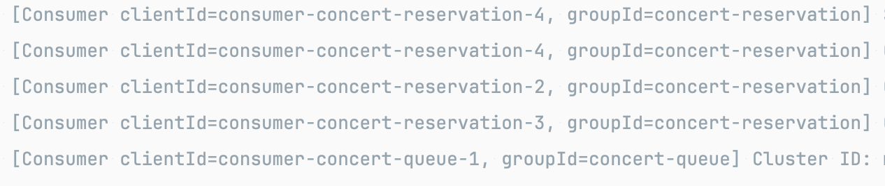

# 📑 STEP 17. 카프카 기초 학습 및 활용

## 1. 카프카 기본 개념

* **분산 메시징 플랫폼**

    * 대규모 실시간 데이터 스트림을 안정적·고성능으로 처리
* **핵심 구성요소**

    * **Producer**: 이벤트(메시지)를 발행하는 주체
    * **Topic**: 메시지를 분류하는 단위 (파티션 단위로 분산 저장)
    * **Broker**: 메시지를 저장하고 클러스터로 운영
    * **Consumer**: 메시지를 구독하고 처리하는 주체
    * **Consumer Group**: 하나의 작업 단위를 여러 Consumer 인스턴스로 분산 처리
* **특징**

    * **내구성(Durability)**: 메시지를 디스크에 저장
    * **확장성(Scalability)**: 파티션 단위로 수평 확장
    * **고가용성(High Availability)**: 복제(replication) 기반 장애 대응
    * **실시간 처리(Streaming)**: 밀리초 단위 이벤트 전달

---

## 2. 카프카 발행 / 소비 원칙
* **발행(Produce)**
    * kafka template은 서비스에서 바로 의존하지 않고 프로듀서 클래스로 감싸서 호출 
    * 순서 보장 필요 시 단일 파티션으로 처리
    * 순서 보장 불필요 시 다중 파티션으로 병렬 처리
* **소비(Consume)**
  * Consume 클래스와 실제 로직 처리 클래스를 분리
  * 장애 시 재시도/재처리 로직 필요(현재 미구현)

### 파티션 개수와 순서 보장

* **단일 파티션**: 메시지가 순차적으로 저장되고 소비됨 → 순서 보장
* **다중 파티션**: 메시지가 여러 파티션에 분산 저장되고 병렬 소비됨 → 순서 보장 불가, 처리량 증가

### 발행 예시 (Spring Boot + Kafka)

```kotlin
// 프로듀서 호출
@Service
class RequestQueueTokenUseCase(
    private val queueProducer: QueueProducer,
    private val queueTokenRepository: QueueTokenRepository
) {
    @Transactional
    fun createToken(userId: Long): Output {
        val newToken = QueueToken.create(userId = userId)
        val token = queueTokenRepository.save(newToken)

        queueProducer.send(QueueEnteredMessage(
            userId = userId,
        ))
    }
}
// 직렬화할 메시지 DTO
data class QueueEnteredMessage(
    val userId: Long = 0L,
)
```

### 소비 예시

```kotlin
// 컨슘
@Component
class QueueListener{
    private val buffer: ConcurrentLinkedQueue<PendingMessage<QueueEnteredMessage>> = ConcurrentLinkedQueue()
    @KafkaListener(
        topics = ["\${app.kafka.topics.queue}"],
        groupId = "concert-queue",
        concurrency = "1"   // 순차 처리 위해 1로 설정
    )
    fun consumeQueue(message: QueueEnteredMessage, ack: Acknowledgment) {
        try {
            buffer.offer(PendingMessage(message, ack))
        } catch (ex: Exception) {
            println("Failed queue consume: ${ex.message}")
        }
    }
    fun poll(): PendingMessage<QueueEnteredMessage>? = buffer.poll()
}
// 실제 구현
@Component
class QueueScheduler(
    private val queueListener: QueueListener,
    private val service: ActivateQueueTokenUseCase,
) {
    @Scheduled(fixedRate = 5000)
    fun processTokens() {
        repeat(ACTIVATE_BATCH_SIZE) {
            val pending = queueListener.poll() ?: return
            try {
                service.execute(pending.payload.userId)
                pending.ack.acknowledge() // 처리 성공 후 커밋
            } catch (ex: Exception) {
                println("Failed to activate token: ${ex.message}")
            }
        }

    }
}
```

## 3. 예약 이벤트 발행 흐름

### 시나리오

* **예약(Reservation)** 이 완료(commit)되면 → Kafka에 이벤트 발행
* 데이터 플랫폼 API 호출하는 이벤트는 어플리케이션 외부 이벤트로 판단하고 카프카 메시지 발행으로 전환
* 현재는 동일 어플리케이션 내에서 consume하여 후속 처리
* 이외의 로직은 어플리케이션 내부 이벤트 유지
* 예약 완료 이벤트는 순차 보장이 중요하지 않으므로 파티션 여러 개로 병렬처리


---

# 📑 STEP 18. 카프카를 활용한 비즈니스 프로세스 개선

## 1. 개선 대상: 대기열 서비스

* **문제**

    * 대기열 진입 시 **트래픽 폭증**으로 서버에 부하
* **개선 아이디어**

    * Kafka의 **비동기 메시징 / 순서 보장 / 확장성**을 활용해 부하 및 병목을 완화하고 메시지 유실을 방지

---

## 2. 설계

### 2-2. 대기열(Queue) 서비스

* **기존**: 모든 요청이 API 서버/DB로 몰림 → 동시성 제어 복잡
* **개선**:

    1. 유저 진입 요청 시 `queue.send` 토픽 발행
    2. Consumer 그룹에서 **토큰 발급 순서 제어** (예: N초당 M명 씩 ACTIVE)
    3. 일단 메시지를 순서대로 받아서 저장 후, 별도 스케줄러가 순서대로 처리

**장점**

* Kafka 파티션을 이용해 **순서 제어**
* Scale-out 가능한 Consumer 그룹으로 처리량 확대 가능

**단점**
* 메시지 처리 지연 시 로컬 메모리에 부하
* 레디스만으로 처리할 때보다 복잡도 증가
