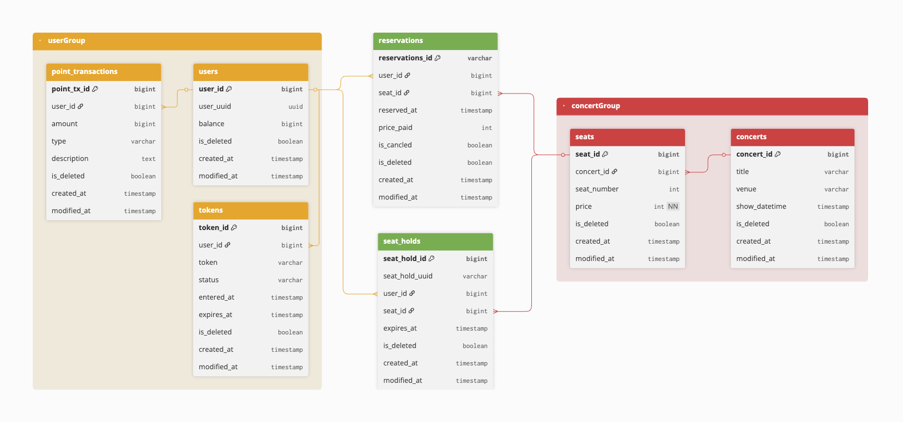

# 🎤 콘서트 예약 서비스

## 📝 프로젝트 개요

이 프로젝트는 콘서트 예약 서비스를 위한 대기열 시스템을 설계하는 것입니다.
사용자는 대기열에 등록하고, 좌석을 점유하며, 결제를 통해 좌석 소유권을 획득할 수 있습니다.
이 시스템은 동시성 제어, 상태 기반 흐름 제어, 무결성 보장 등을 고려하여 설계하였습니다.

## 📚 설계 문서
- [요구사항 분석](1_requirements.md)
- [ERD](2_erd.md)
- [시퀀스 다이어그램](3_sequence_diagram.md)
- [상태 다이어그램](4_state_diagram.md)
- [API 명세](https://joyseohee.github.io/hhplus-concert-server)
- [DB 성능 보고서](5_db_report.md)
### 동시성 문제 보고서
- [동시성 이슈 : DB Lock 보고서](6_db_race_condition_report.md)
- [동시성 이슈 : 분산락 보고서](7_redis_distributed_lock_report.md)
### 캐시 전략 보고서
- [캐시 전략 보고서](8_redis_cash_report.md)
### 레디스 저장소 보고서
- [자료구조를 활용한 랭킹 시스템, 비동기 시스템 설계 및 구현 보고서](9_redis_datastructure.md)
- [도메인 분리 이후 트랜잭션 처리 전략 및 한계 분석](10_edd_transaction_doc.md)
- [이벤트 호출 로직 시퀀스 다이어그램](11_event_call_sequence_diagram.md)

## 📋 ERD

