# 🎤 콘서트 예약 서비스

## 📝 프로젝트 개요

이 프로젝트는 콘서트 예약 서비스를 위한 대기열 시스템을 설계하는 것입니다.
사용자는 대기열에 등록하고, 좌석을 점유하며, 결제를 통해 좌석 소유권을 획득할 수 있습니다.
이 시스템은 동시성 제어, 상태 기반 흐름 제어, 무결성 보장 등을 고려하여 설계하였습니다.

## 📚 설계 문서
- [요구사항 분석](1_requirements.md)
- [ERD](2_erd.md)
- [시퀀스 다이어그램](3_sequence_diagram.md)
- [상태 다이어그램](4_state_diagram.md)
- [API 명세](https://joyseohee.github.io/hhplus-concert-server)
- [DB 성능 보고서](5_db_report.md)
### 동시성 문제 보고서
- [동시성 이슈 : DB Lock 보고서](6_db_race_condition_report.md)
- [동시성 이슈 : 분산락 보고서](7_redis_distributed_lock_report.md)
### 캐시 전략 보고서
- [캐시 전략 보고서](8_redis_cash_report.md)
### 레디스 저장소 보고서
- [자료구조를 활용한 랭킹 시스템, 비동기 시스템 설계 및 구현 보고서](9_redis_datastructure.md)
- [도메인 분리 이후 트랜잭션 처리 전략 및 한계 분석](10_edd_transaction_doc.md)
- [이벤트 호출 로직 시퀀스 다이어그램](11_event_call_sequence_diagram.md)
### 카프카 설계 문서
- [카프카 기초 학습 및 활용](12_kafka.md)
### 부하테스트
- [카프카 부하 테스트](13_load_test.md)

## 📋 시퀀스 다이어그램

```mermaid
sequenceDiagram
    participant User
    participant QueueService
    participant TokenValidator
    participant SeatHoldService
    participant PaymentService

    %% 1. 토큰 발급
    User->>QueueService: 토큰 발급 요청
    QueueService-->>User: 토큰 발급 (WAITING 상태)

    %% 2. 폴링으로 진입 상태 확인
    loop 폴링 반복
        User->>QueueService: 순번 및 상태 확인
        QueueService->>TokenValidator: 토큰 상태 확인
        alt 토큰 만료
            TokenValidator-->>User: 만료됨
        else 진입 가능(READY)
            TokenValidator-->>User: 진입 가능
        else 대기중
            TokenValidator-->>User: 대기중
        end
    end

    %% 3. 좌석 점유 시도
    User->>SeatHoldService: 좌석 점유 요청
    alt 좌석 점유 성공
        SeatHoldService-->>User: 점유 성공 (heldUntil 포함)
    else
        alt 좌석 점유 실패 - 이미 점유됨
            SeatHoldService-->>User: 점유 실패
        else 좌석 점유 실패 - 기존 점유 만료됨
            SeatHoldService->>SeatHoldService: 만료된 점유 삭제
            SeatHoldService->>SeatHoldService: 재시도하여 점유 성공
            SeatHoldService-->>User: 점유 성공
        end
    end

    %% 4. 결제
    User->>PaymentService: 결제 요청
    alt 잔액 부족
        PaymentService-->>User: 결제 실패
    else 결제 성공
        PaymentService->>TokenValidator: 토큰 상태 → 만료
        PaymentService-->>User: 결제 성공
    end

```

