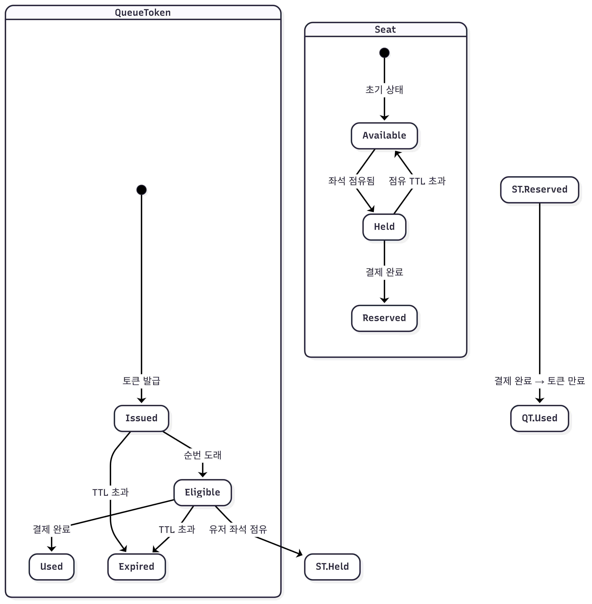

# 🎤 콘서트 예약 서비스

## 📝 프로젝트 개요

이 프로젝트는 콘서트 예약 서비스를 위한 대기열 시스템을 설계하는 것입니다.
사용자는 대기열에 등록하고, 좌석을 점유하며, 결제를 통해 좌석 소유권을 획득할 수 있습니다.
이 시스템은 동시성 제어, 상태 기반 흐름 제어, 무결성 보장 등을 고려하여 설계하였습니다.

## 📚 설계 문서
- [요구사항 분석](1_requirements.md)
- [ERD](2_erd.md)
- [시퀀스 다이어그램](3_sequence_diagram.md)
- [상태 다이어그램](4_state_diagram.md)
- [API 명세](https://joyseohee.github.io/hhplus-concert-server)

## 📋 상태 다이어그램

